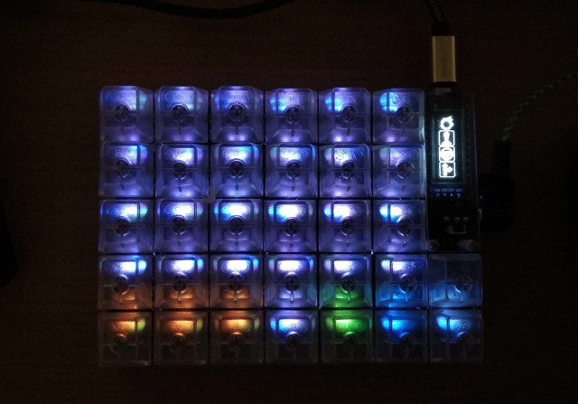

# Helix Remix
Customized QMK Firmware for Helix keyboard

## :question: What's this?

[QMK](https://github.com/qmk/qmk_firmware) is the hardware firmware for Pro Micro an Arduino compatible microcontroller. It specializes in the control of USB HID keyboard devices and has been adopted by many DIY keyboards.

[Helix](https://github.com/MakotoKurauchi/helix) is a famous DIY keyboard kit in Japan developed by MakotoKurauchi, and this project doesn't require any code changes for Helix.

This program is published for learning to develop your own firmware. However, I would be glad if you introduced here with "This site and articles were helpful for me".

## :memo: Technical note

A built firmware is including in "build" folder. Write this hex file by [QML Toolbox](https://qmk.fm/toolbox/) and you can use all the features without any programming.

Helix Remix has following features:
- Full scratched code for the latest QMK APIs.
- Change the color of any key by LED layer API [[Technical article](https://www.tnksoft.com/blog/?p=8285)].
- Show any bitmap to OLED display [[Technical article](https://www.tnksoft.com/blog/?p=8291)].
- Data synchronization for a split keyboard [[Technical article](https://www.tnksoft.com/blog/?p=8309)].
- Fainal Fantasy 14 Mode(Exsample about locking the current key layer by pressing the function key).  

In FF14 mode, if you press the target key once, it will return to the previous key layer. To lock FF14 key layer, press the FF14 mode key twice quickly.

"tools" folder contains the tools for Helix Remix. Those tools requires Python3 develop environment.
- **hex2hsv.py** : Changes the name and HTML color code to a C define statement, described in the CSV.
- **img2hex.py** : Optimized bitmap files to OLED binary image text.

To enable split keyboard synchronization, you need to rewrite the core of QMK. Copy the files under the "qmk_transport" folder to QMK's core program codes.

If you don't need synchronization, please remove the compile option "OPT_DEFS += -DHREMIX_DATA_ENABLE".

## :yen: Donate, please!

## :copyright: License
[MIT](http://opensource.org/licenses/MIT)